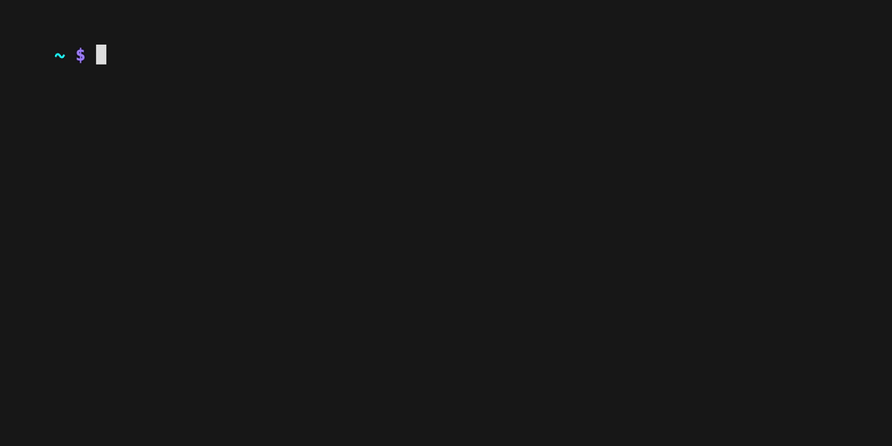

Developers often have sensitive environment variables that they need to populate on
their development machine. This might include [Github Personal Access Tokens](https://docs.github.com/en/authentication/keeping-your-account-and-data-secure/managing-your-personal-access-tokens)
and [AWS access keys](https://docs.aws.amazon.com/IAM/latest/UserGuide/id_credentials_access-keys.html).
One way to achieve this is to store these environment variables in your
local `~/.bashrc` or `~/.zshrc`.

Best practices suggest that you never leave your machine unlocked when you're away from it
and you always have full-disk encryption enabled ([FileVault on OS X](https://support.apple.com/en-us/HT204837)).

Keeping sensitive credentials off of your machine altogether gives you another layer of protection.

At the same time, I want to load these sensitive environment variables easily.

To do this, I use [Bitwarden's](https://bitwarden.com/) [CLI](https://bitwarden.com/help/cli/).
This pattern can be done with similar products that have a CLI, like [1Password](https://developer.1password.com/docs/cli/).
You can walk through a demo of that [here](https://blog.gruntwork.io/how-to-securely-store-secrets-in-1password-cli-and-load-them-into-your-zsh-shell-when-needed-dd7a716506c8).

Let's take a look at the end result.

To make this all work, there are only a few steps for zsh (you can extend the example to other shells if desired):

1. Install the [Bitwarden CLI](https://bitwarden.com/help/cli/)
2. Copy the `bw-env` script into place
3. Tell `zsh` to load in bw-env automatically
4. Reload your shell

The code and full instructions and examples are available at [https://github.com/FulcrumOps/bw-env](https://github.com/FulcrumOps/bw-env).
